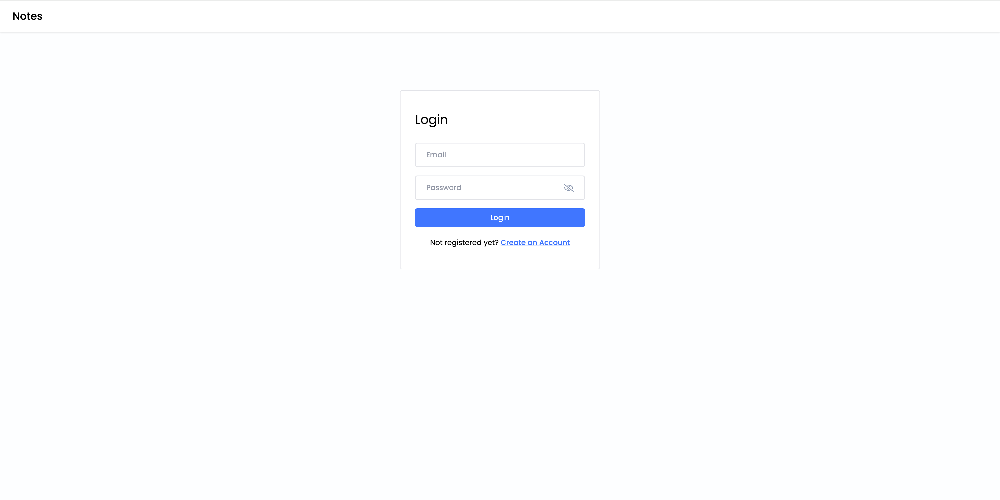
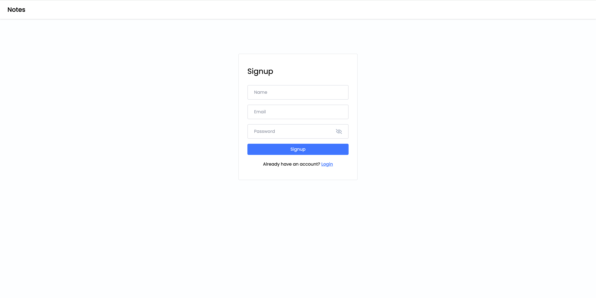
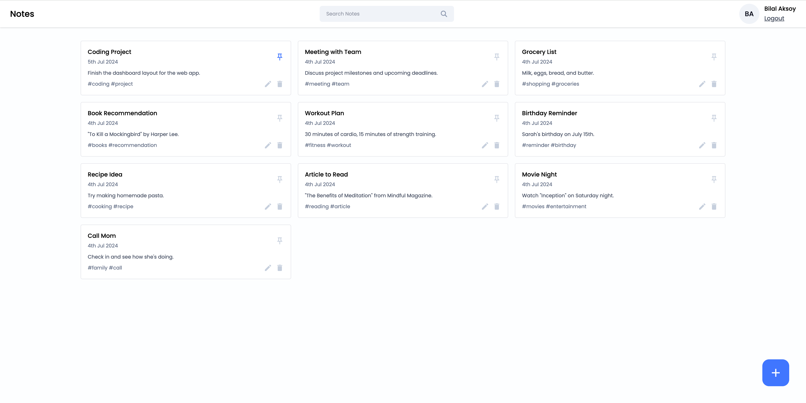
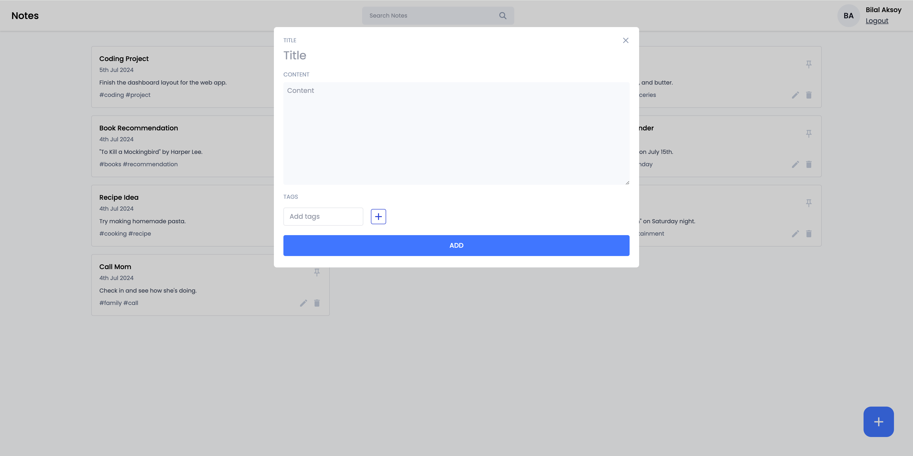

# Notes App

This is a notes app that allows users to authenticate and manage their notes. It is built using React and Tailwind CSS. This frontend is for the backend available [here](https://github.com/BiAksoy/notes-app-backend).

## Getting Started

### Requirements

- Node.js

### Installation

1. Install the dependencies:

   ```bash
   npm install
   ```

2. By default, the app is configured to use the backend running on `http://localhost:8000`. If you are running the backend on a different URL, you can change the `BASE_URL` in `src/utils/constants.js`:

   ```javascript
   export const BASE_URL = 'http://localhost:8000'
   ```

3. Start the development server:

   ```bash
   npm run dev
   ```

   The application will start on `http://localhost:5173`.

## Screenshots








